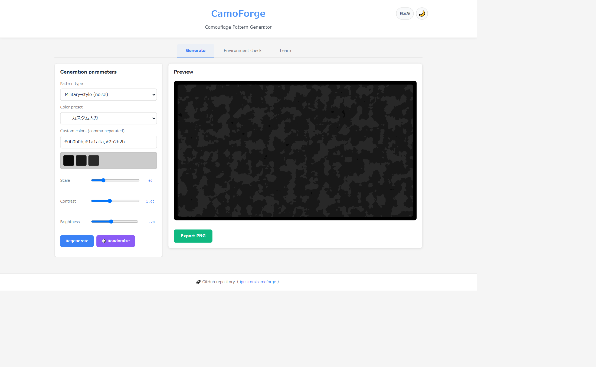
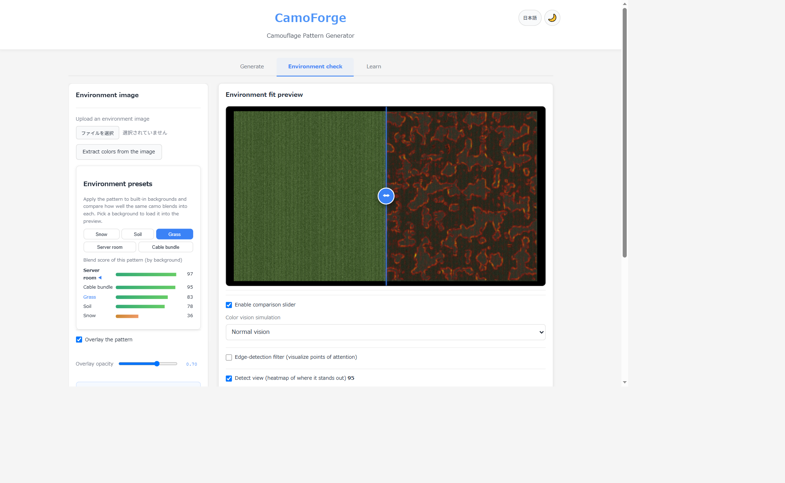

# CamoForge - A Camouflage Pattern Generator

[日本語](README.md) | **English**


[](https://ipusiron.github.io/camoforge/)

**Day085 - Security Tools 100 with Generative AI**

**CamoForge** is a web-based tool that generates camouflage designs and lets you overlay them on an environment image to see "how they look".

- Camouflage pattern generation (Perlin noise, stripes, panel patterns, and more)
- Over 20 military palettes built in (Woodland BDU, MARPAT, MultiCam, and others)
- **Color vision simulation**: check how the camo looks under protanopia, deuteranopia, tritanopia and monochrome vision
- Overlay on an environment photo to preview (opacity adjustment, comparison slider, edge detection)
- A "Learn" tab for background knowledge
- Save the result as a PNG

With an environment-fit check that integrates color vision simulation, you can **evaluate a camouflage pattern from the viewpoint of observers with color-vision diversity**. This is a rare implementation that combines security education, accessibility and design verification.

The interface has a Japanese / English toggle (top right).

---

## 🌐 Demo

👉 **[https://ipusiron.github.io/camoforge/](https://ipusiron.github.io/camoforge/)**

Try it directly in your browser.

---

## 📸 Screenshots

>
>*Pattern generation tab*
>
>
>*Environment check — environment-preset comparison and the "edges" cue of the detect view*

---

## ⚙️ Features

### 1️⃣ Generate tab

- **Pattern types** (6): military-style (noise), digital camo (pixel), cable bundle (stripes), hardware panel (grid), matte black (vignette), custom noise
- **Color presets**: over 20 military palettes, or enter your own comma-separated colors
- **Scale / contrast / brightness** sliders
- **Regenerate** (new seed) and **Randomize** (randomize colors and parameters for the current type)
- Export the pattern as a PNG

### 2️⃣ Environment check tab

This is CamoForge's signature feature — an environment-fit check with integrated color vision simulation.

- **Upload** an environment image and overlay the pattern (opacity, comparison slider)
- **Extract colors from the image** (k-means) to build a palette specific to that background
- **Blend score**: the gap in color, brightness and contrast between the pattern and the background (0–100)
- **Detect view**: a heatmap of where the composite stands out, broken down into cues you can switch between
  - **Edges (silhouette)** — luminance gradient; the object's outline against the background
  - **Gloss (highlights)** — bright spots relative to the neighborhood; reflections of non-matte surfaces or connectors
  - **Straight lines (man-made edges)** — strong edges that continue straight; rare in nature
  - **Color difference** — deviation from the background's local mean
- **Environment presets**: built-in backgrounds (snow, soil, grass, server room, cable bundle). The same pattern is scored against every background and ranked, so you can confirm — with numbers — that **there is no universal camouflage**.
- **Color vision simulation**: normal / protanopia / deuteranopia / tritanopia / monochrome, applied to the composite
- **Edge-detection filter** (Sobel) and **composite export**

### 3️⃣ Learn tab

Background on the principles and history of camouflage, modern trends, the relationship between physical and cyber camouflage, human factors (color-vision diversity), **animal camouflage in nature** (background matching, disruptive coloration, countershading, seasonal change, mimicry, staying still), notes on real devices, and an educational summary.

---

## 🎯 What makes this tool different

CamoForge does not only "make" camouflage — it scores what you made against a background. Uses that set it apart from other pattern generators:

- With the environment-preset comparison, apply the same camo to snow, soil, grass, a server room and a cable bundle, and see at a glance which background it blends into and which it stands out against. Confirm "there is no universal camouflage" with your own pattern.
- Extract colors from an environment image to build a palette specific to that site, and confirm with numbers that the blend score goes up.
- With the detect view, find the places where edges, gloss or luminance differences remain even when the color matches. This is training for the finding side (detection and inspection), not the hiding side.
- Overlay color vision simulation on the composite to find patterns that blend under normal vision but stand out under a particular color vision.

---

## 📁 Directory structure

```
camoforge/
├── index.html              # Main HTML (3 tabs)
├── style.css               # Stylesheet (dark/light mode)
├── js/
│   ├── color-utils.js      # Color utilities (DOM-free, tested)
│   ├── cable-plan.js       # Cable-bundle layout (seeded, tested)
│   ├── blend-score.js      # Blend score (DOM-free, tested)
│   ├── palette-extract.js  # Palette extraction from an image (DOM-free, tested)
│   ├── detect-map.js       # Combined detectability heatmap (DOM-free, tested)
│   ├── env-presets.js      # Environment presets and blend comparison (DOM-free, tested)
│   ├── detect-cues.js      # Detection cues: edges/gloss/lines/color (DOM-free, tested)
│   ├── messages.js         # JA/EN dictionary
│   ├── i18n.js             # Language switching
│   ├── perlin.js           # Perlin noise
│   └── main.js             # Main logic (UI, rendering, filters)
├── data/presets.json       # Color presets
├── test/                   # Automated tests (node --test)
└── assets/                 # Images
```

---

## 🧪 Tests

```bash
npm test
```

No dependencies — runs on Node's built-in test runner (`node --test`). It verifies the color utilities, reproducibility of the cable-bundle plan, the blend score, palette extraction from an image, the detectability heatmap, environment-preset generation and blend comparison, the detection cues (edges/gloss/lines/color), the JA/EN dictionary parity, the CSP and elements in index.html, and the README wording.

---

## 🚨 Notes

- This tool is for **education, research and design use only**.
- The visual evaluation is for reference only. Sensors such as NIR, thermal and LiDAR require separate evaluation.
- Please be mindful of accessibility (especially color-vision diversity) and use non-color cues as well.

---

## 📄 License

- See the `LICENSE` file for the source-code license.

---

## 🛠️ About this tool

This tool was developed as part of the "Security Tools 100 with Generative AI" project, in which security-related tools are built and published over 100 days with the help of AI.

See the project page for details and other tools:

🔗 [https://akademeia.info/?page_id=42163](https://akademeia.info/?page_id=42163)
