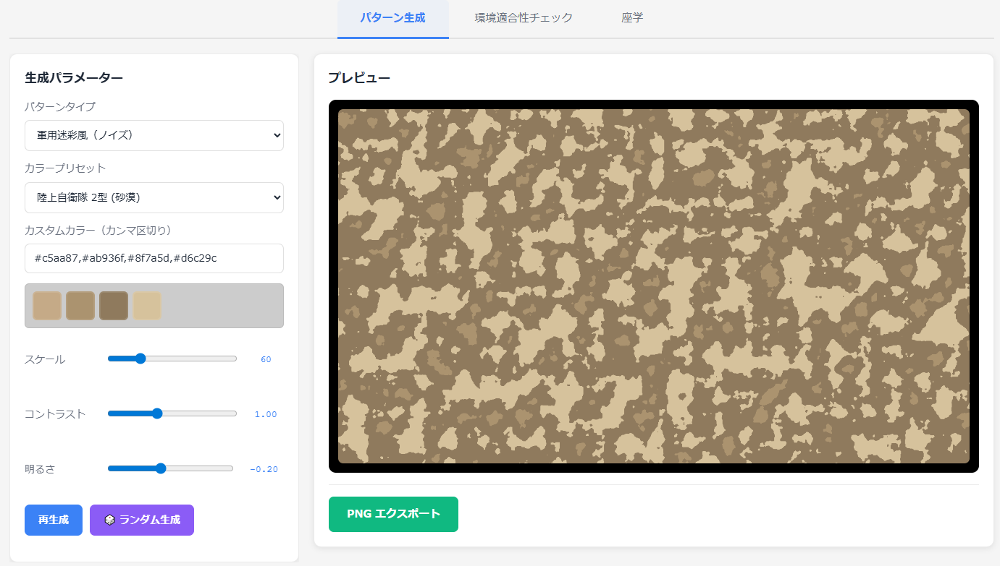
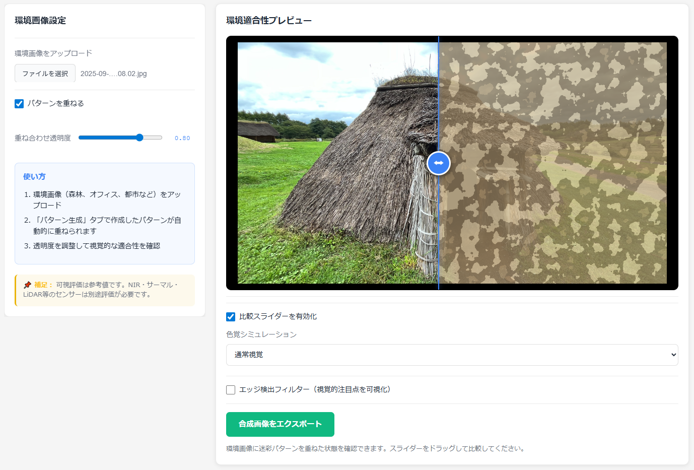

<!--
---
title: CamoForge
category: visualization
difficulty: 2
description: Web-based generator for camouflage patterns — create, experiment, and study how designs blend into different environments. Educational and research use only.
tags: [camouflage, visualization, security-education, javascript, perlin-noise]
demo: https://ipusiron.github.io/camoforge/
---
-->

# CamoForge - カモフラージュデザイン生成ツール


[](https://ipusiron.github.io/camoforge/)


**Day085 - 生成AIで作るセキュリティツール100**

**CamoForge** は、カモフラージュ用のデザインを生成し、環境画像に重ねて「どのように見えるか」を確認できるWebベースのツールです。

- 迷彩パターン生成（Perlinノイズ、ストライプ、パネル模様など）
- 軍用迷彩パレット20種以上収録（Woodland BDU、MARPAT、MultiCam等）
- **色覚シミュレーション**：1型・2型・3型色覚、モノクロ視覚で迷彩の見え方を検証
- 環境写真に重ねてプレビュー（アルファ調整、比較スライダー、エッジ検出）
- 教育用の「座学」タブで背景知識を学習
- 出力結果をPNGとして保存可能

色覚シミュレーション機能を統合した環境適合性チェック機能により、**色覚多様性（色弱・色覚異常）を持つ観察者の視点で迷彩パターンを評価**できます。
これはセキュリティ教育・アクセシビリティ・デザイン検証を統合した世界でも稀有な実装といえます。

---

## 🌐 デモページ

👉 **[https://ipusiron.github.io/camoforge/](https://ipusiron.github.io/camoforge/)**

ブラウザーで直接お試しいただけます。

---

## 📸 スクリーンショット

>
>*迷彩柄「陸上自衛隊2型・砂漠」の生成*
>
>
>*三内丸山遺跡で迷彩柄を着たらどうなるか*

---

## ⚙️ 本ツールの機能

### 1️⃣ パターン生成タブ

迷彩パターンを生成し、パラメーターを調整できます。

- **パターンタイプ**（5種類）
  - 軍用迷彩風（ノイズ）：Perlinノイズベースの自然な迷彩
  - ケーブル群（ストライプ）：オフィス・サーバールームのケーブル背景を模倣
  - ハードウェアパネル（グリッド）：機器パネルや通気口を模倣
  - 漆黒マット（ビネット）：光学ブラック調の暗所向け質感
  - カスタムノイズ：パラメーター自由調整

- **カラープリセット**（50種類以上）
  - 軍用迷彩：Woodland BDU、MARPAT（森林/砂漠）、MultiCam、OCP、Flecktarn、陸上自衛隊1型/2型など20種
  - ケーブル群：Dark Neutral、Graphite、Charcoal Mix、Off-White Bundleなど10種
  - ハードウェアパネル：Gunmetal、Anthracite、Brushed Steelなど10種
  - オフィス背景：Wall White、Wood Desk、Carpet、Ceiling Gridなど10種

- **パラメーター調整**
  - スケール：8～300（パターンの大きさ）
  - コントラスト：0.2～2.5（明暗の強さ）
  - 明るさ：-1.0～1.0（全体の明度）

- **ランダム生成機能**：現在のパターンタイプを維持したまま、カラー・パラメーターをランダム化

- **PNGエクスポート**：生成したパターンを1280×720pxの画像として保存

### 2️⃣ 環境適合性チェックタブ（本ツールの独自機能）

CamoForgeの最大の特徴は、**色覚シミュレーション機能を統合した環境適合性チェック**です。
他の迷彩パターンジェネレーターには見られない、アクセシビリティとセキュリティ教育を融合した独自機能を提供します。

#### 環境画像アップロード
- **対応形式**：JPEG、PNG、GIF、WebP、BMP
- **ファイルサイズ制限**：最大10MB
- **クライアントサイド処理**：アップロードした画像は外部サーバーに送信されません

#### 📊 比較スライダー
- **Before/After比較**：ドラッグ可能なスライダーで「環境のみ」⇄「迷彩重ね合わせ」を視覚的に比較
- **透明度調整**：0.0～1.0の範囲で迷彩パターンの透明度を調整
- **リアルタイムプレビュー**：スライダーを動かすとその場で結果を確認

#### 👁️ 色覚シミュレーション（本ツール独自の強み）

**なぜ重要か？**
迷彩パターンの有効性は「誰が見ても同じ」ではありません。色覚多様性（色覚異常、色弱）を持つ人の視点では、通常視覚とはまったく異なる見え方になります。

- **通常視覚（Normal Vision）**：一般的な3色型色覚
- **1型色覚（赤弱 / Protanopia）**：赤系統の識別が困難。赤茶色の迷彩が緑に近く見える
- **2型色覚（緑弱 / Deuteranopia）**：緑系統の識別が困難。森林迷彩が褐色に近く見える
- **3型色覚（青弱 / Tritanopia）**：青系統の識別が困難。都市迷彩の青灰色が変化する
- **モノクロ（全色盲 / Monochrome）**：色情報を持たず、コントラストのみで判断

**実装技術**：行列変換による色空間変換（RGB → 各色覚タイプのRGB）

**実践的な意義**
1. **セキュリティ教育**：「色だけに頼った迷彩は一部の観察者には無効」という事実を体験的に学べる
2. **デザイン検証**：ユニバーサルデザインの観点から、色覚多様性を考慮したパターン設計が可能
3. **視覚認識研究**：人間の視覚システムの多様性と限界を実感できる教材

**他ツールとの差別化ポイント**
- 色覚シミュレーションを **迷彩パターンと環境画像の合成結果に適用** できるツールは極めて稀
- リアルタイム切り替えで「通常視覚では馴染むが色弱者には目立つ」パターンを即座に発見可能
- セキュリティ・アクセシビリティ・デザインの3分野を横断する唯一無二の教育ツール

#### 🔍 エッジ検出フィルター
- **Sobelオペレーター**による輪郭強調フィルター（コンピュータービジョンの標準手法）
- **視覚的注目点の可視化**：迷彩が破綻する箇所（エッジが強い箇所）を発見
- **検出訓練**：コンピュータービジョンの視点で「人工物検出」を体験

#### 合成画像エクスポート
- 環境画像と迷彩パターンを重ねた合成結果をPNG形式で保存可能

### 3️⃣ 座学タブ

迷彩パターンの歴史・理論・応用を学べる教育コンテンツ。

- **迷彩の原理**：「背景との一体化」の本質
- **歴史的背景**：第一次世界大戦での軍事迷彩、自然界の擬態研究
- **現代のトレンド**：都市迷彩、デジタル迷彩（MARPAT等）、マルチスケール迷彩（MultiCam）、アート・デザインへの応用
- **利用シーン**：軍事／狩猟／産業デザイン／舞台芸術／教育用途
- **物理とサイバーの関係**：物理迷彩＝視覚的ノイズ、サイバー迷彩＝難読化・トラッキング回避
- **ヒューマンファクター**：色覚多様性への配慮、UI設計における可読性の重要性
- **実機デバイスにおける考察**：Raspberry Pi、USBデバイス、無線AP等での迷彩の限界と検出手法

---

## 📜 迷彩パターンの歴史と考察

- **全地形型迷彩（MTP）**  
  イギリス軍は森林地帯と砂漠の活動域を行き来する兵士のために、どちらにも通用する絶妙なバランスの迷彩柄を新開発した。背景環境に依存しすぎず、幅広い環境で有効に機能する「全地形型（Multi-Terrain Pattern）」である。

- **MARPAT（マーパット）**  
  米軍海兵隊では、ハイテクを応用したデジタル迷彩パターン（MARPAT）を採用している。従来の「大きな斑点」ではなく、ピクセル化された細かな矩形の集合体を用いることで、視覚認識の錯覚を誘発し、検出を難しくしている。

- **自然と人工物のギャップ**  
  自然界は不揃いでランダムなパターンを生み出す。異なる種類の葉が混じり合う場所は特にそうである。  
  一方、人間は同じ形を規則的に並べてパターンを作りたがる。この「規則性」が人工物を目立たせる要因のひとつである。  
  このギャップを克服した例が **ギリー・スーツ** であり、草や枝といった自然物を身にまとい、背景に溶け込む。

- **色調の違い**  
  人間は原色を好んで使う傾向があるが、自然の色は柔らかく、くすんだ色調である。この違いも人工物を際立たせる。  
  理想的なカモフラージュとは、それを身につけた者や物体が背景と限りなく同化して見える状態を指す。

---

## 🔬 CamoForgeでの追加考察

CamoForgeでは、以下のような「人工物に特有の背景」を想定した迷彩パターンを生成できる。

### 漆黒パターン（Black Matte）
- **特徴**：光をほとんど反射しない「漆黒」の質感を模倣。舞台美術や光学機器で用いられる「光学ブラック」に近い見え方を再現できる。  
- **考察**：暗所や黒いケーブル群と並ぶと輪郭が弱まり、目立ちにくくなる。ただし明るい背景では逆に強いシルエットとなるため万能ではない。  
- **セキュリティ的示唆**：可視光では有効でも、近赤外線カメラやサーマルカメラでは輪郭や温度差が残り、完全な隠蔽はできない。

### ケーブル群パターン（Cable Bundle）
- **特徴**：オフィスやサーバールームに多い、黒〜灰色のケーブルが束になった様子を模倣。細いストライプをランダムに蛇行させて描画。  
- **考察**：規則的な直線ケーブルは本来人工的だが、複数の太さ・色・角度が入り乱れることで「不規則さ」が増し、背景と同化しやすくなる。  
- **セキュリティ的示唆**：こうした環境では「見慣れた人工背景に溶け込む迷彩」が有効であり、必ずしも自然界のパターンを真似る必要はない。

### ハードウェア群パターン（Hardware Panel）
- **特徴**：サーバーパネルやルーター筐体に見られる、グリッドや通気口、ビスのパターンを模倣。  
- **考察**：人工的な矩形やスリットをランダム要素と混ぜることで、単調さを減らし「実際にそこにあるべきパネルらしさ」を演出できる。  
- **セキュリティ的示唆**：背景そのものを再現する発想。カモフラージュは「自然に見せる」だけでなく「環境の一部と錯覚させる」方向にも応用可能である。

--

## 🎭 迷彩の本質は「背景との一体化」

迷彩の本質は **「背景との一体化」** にある。  
自然環境では葉や土壌のランダム性に合わせ、人工環境ではケーブルやパネルの見慣れたパターンに合わせる。  

CamoForgeはその違いを体感的に学ぶための教育ツールであり、  
- 自然 vs 人工物の「規則性のギャップ」  
- 色調（原色 vs くすみ色）  
- 視覚 vs 他波長センサー（NIR・サーマル）の違い  

といったセキュリティ・デザイン上の論点を探究する足がかりとなる。

---

## 🖥️ 実機例における考察

CamoForgeで生成した迷彩パターンを、実際のデバイスの見え方を想定して考察する。

### 小型コンピューター（Raspberry Pi 等）
- **特徴**：緑色の基板と黒いチップ、コネクタ類が目立つ。机上やラックに置くと「基板らしい外観」がすぐに認識される。  
- **考察**：漆黒パターンで全体を覆えば暗所では目立たなくなるが、基板の端子や LED が強い「人工的シグナル」として浮き出る。  
- **教育的ポイント**：環境に溶け込むように見えても、セキュリティ管理者は「不自然な端子」「配線パターン」に注目することで発見できる。

### USBデバイス（ドングル・ストレージ）
- **特徴**：小型かつ単色プラスチック筐体。USBポートから突き出る形で利用される。  
- **考察**：黒や灰色のケーブル群の中に置けば視覚的には馴染むが、突起物としてのシルエットは残る。  
- **教育的ポイント**：監視者は「規則的な配列を崩す要素」を検知すべきであり、迷彩パターンだけでは完全に同化できない。

### 無線アクセスポイント（不正 AP 想定）
- **特徴**：小型の白色筐体やアンテナが多い。天井や壁に設置されると「正規の機器」と区別が難しい場合がある。  
- **考察**：オフィス背景（壁白や天井グリッド）パターンと重ねると目立ちにくい。しかし通風孔やLEDランプの光は人工的で強調される。  
- **教育的ポイント**：背景に同化する色や模様があっても、通信挙動や LED ランプの点滅が決定的な発見手がかりとなる。

### ネットワーク機器（ルーターやハブ）
- **特徴**：前面のポート列、通気口、ステータスLEDが視認性を高める。  
- **考察**：ハードウェアパネルパターンを使えばラック全体に「馴染む」外観になるが、ポートの占有やLED点灯は容易に見破られる。  
- **教育的ポイント**：視覚迷彩だけでは不十分であり、**機能的シグナル（通信・光・発熱）**を含めた検出が不可欠である。

### 教育的まとめ

- **人工物は人工物らしい手がかりを必ず残す**：端子、LED、規則的な配列は自然環境には存在しない。  
- **CamoForge の意義**：  
  - 「なぜ人工物が目立つのか」を可視化して学べる  
  - 「どのように馴染んで見えるのか」を実験できる  
  - 視覚だけでなく、センサー・通信挙動を総合して検出する必要性を理解できる  

---

## 🎯 本ツールの対象ユーザー

本ツールは、以下のような方々を対象としています：

- **セキュリティ研究者・教育者**：物理セキュリティや視覚的検出の原理を教える教材として
- **デザイナー・クリエイター**：迷彩パターンのデザイン実験やアートワーク制作
- **アクセシビリティ専門家**：色覚多様性を考慮したデザイン検証ツールとして
- **学生・研究者**：視覚認識、コンピュータービジョン、心理学の学習教材
- **ゲーム開発者**：キャラクター・環境デザインの迷彩効果検証
- **舞台美術・映像制作者**：背景との視覚的調和を事前検証
- **セキュリティエンジニア**：監視カメラ検出訓練や物理セキュリティ評価

---

## 💡 具体的な活用シナリオ

### シナリオ1：セキュリティ教育「色覚多様性と検出の限界」

**状況**：企業のセキュリティ研修で、物理的な侵入検知の重要性を教える

**活用方法**：
1. オフィス環境の写真をアップロード
2. 「ハードウェアパネル」パターンを生成し、環境に重ねる
3. **通常視覚モード**で「背景に馴染んで見える」ことを確認
4. **色覚シミュレーション（1型・2型色覚）**に切り替え
5. 「色覚タイプによっては逆に目立つ」ことを実演

**学習効果**：
- 「色だけに頼った迷彩は万能ではない」という事実を体験的に理解
- 監視システムでは「複数の検出手段（動き検知、温度、通信）」が必要であることを認識
- インクルーシブなセキュリティ設計の重要性を学ぶ

---

### シナリオ2：アクセシビリティデザイン検証「UI要素の視認性チェック」

**状況**：Webサイトやアプリの配色設計で、色覚多様性への配慮を検証したい

**活用方法**：
1. デザインモックアップ画像をアップロード
2. 背景色と前景色のコントラストパターンを生成
3. **色覚シミュレーション**で各色覚タイプでの見え方を確認
4. **エッジ検出フィルター**で「形状による識別可能性」を評価
5. 色だけでなく形状・コントラストでも区別できるか検証

**学習効果**：
- WCAG（Web Content Accessibility Guidelines）のコントラスト要件を視覚的に理解
- 色覚異常を持つユーザーの視点を体験
- ユニバーサルデザインの実践的スキル習得

---

### シナリオ3：ゲーム開発「ステルスゲームの迷彩効果バランス調整」

**状況**：ステルスアクションゲームで、プレイヤーキャラクターの迷彩服デザインを検討

**活用方法**：
1. ゲーム内環境（森林、都市、雪原）のスクリーンショットをアップロード
2. 各環境用の迷彩パターン（Woodland、Urban Gray、雪原用白系）を生成
3. **比較スライダー**で「どの程度背景に溶け込むか」を視覚的に評価
4. **エッジ検出**で「プレイヤーが見つけやすい箇所」を特定
5. ゲームバランスに応じて「適度に見つかる」パターンを選択

**学習効果**：
- ゲームデザインにおける「視認性とゲーム性のバランス」を体感
- 環境ごとの最適な迷彩パターンの違いを理解
- プレイテスト前の事前検証による開発効率化

---

## 🔧 技術仕様

- HTML / CSS / JavaScript（Vanilla）
- Canvas APIによる迷彩パターン描画
- Perlinノイズを用いた自然風模様生成
- **色覚シミュレーション**：行列変換による色空間変換（Protanopia/Deuteranopia/Tritanopia/Monochrome）
- **エッジ検出**：Sobelオペレーターによる輪郭抽出
- クライアントサイドのみで処理（アップロード画像は外部送信されません）

---

## 🚨 注意事項

- 本ツールは **教育・研究・デザイン用途専用** 。  
- 高吸収素材の実機利用には安全上のリスク（放熱阻害、温度上昇）があるため、実験は必ずモックアップで行う。
- アクセシビリティー（とくに色覚多様性）に配慮し、色以外の識別手段も利用する。

---

## 📁 ディレクトリー構成

```
camoforge/
├── index.html              # メインHTMLファイル（3タブ構成）
├── style.css               # スタイルシート（ダーク/ライトモード対応）
├── .nojekyll              # GitHub Pages設定（Jekyllビルド無効化）
│
├── js/                     # JavaScriptファイル
│   ├── main.js            # メインロジック（UI制御、描画、フィルター処理）
│   └── perlin.js          # Perlinノイズ生成ライブラリ
│
├── data/                   # データファイル
│   └── presets.json       # カラープリセット定義（50種以上）
│
├── assets/                 # 画像アセット
│   ├── screenshot.png     # スクリーンショット1
│   └── screenshot2.png    # スクリーンショット2
│
├── README.md               # プロジェクト説明書
├── CLAUDE.md               # 開発者向けドキュメント（Claude Code用）
├── LICENSE                 # MITライセンス
└── .gitignore             # Git除外設定
```

### 主要ファイルの役割

- **index.html**: アプリケーションの構造定義。3つのタブ（パターン生成、環境適合性チェック、座学）を実装
- **style.css**: レスポンシブデザイン、CSS変数によるテーマ切り替え、比較スライダーのスタイル
- **js/main.js**:
  - パターン生成ロジック（4種類の描画アルゴリズム）
  - 色覚シミュレーション（行列変換による色空間変換）
  - エッジ検出（Sobelオペレーター）
  - 環境画像との合成処理
- **js/perlin.js**: Perlinノイズ生成（自然な迷彩パターン用）
- **data/presets.json**: 軍用迷彩20種、ケーブル/ハードウェア/オフィス背景各10種のカラー定義

---

## 📄 ライセンス

MIT License – 詳細は [LICENSE](LICENSE) を参照してください。

---

## 🛠 このツールについて

本ツールは、「生成AIで作るセキュリティツール100」プロジェクトの一環として開発されました。
このプロジェクトでは、AIの支援を活用しながら、セキュリティに関連するさまざまなツールを100日間にわたり制作・公開していく取り組みを行っています。

プロジェクトの詳細や他のツールについては、以下のページをご覧ください。

🔗 [https://akademeia.info/?page_id=42163](https://akademeia.info/?page_id=42163)
